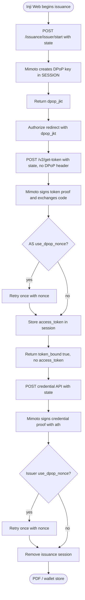
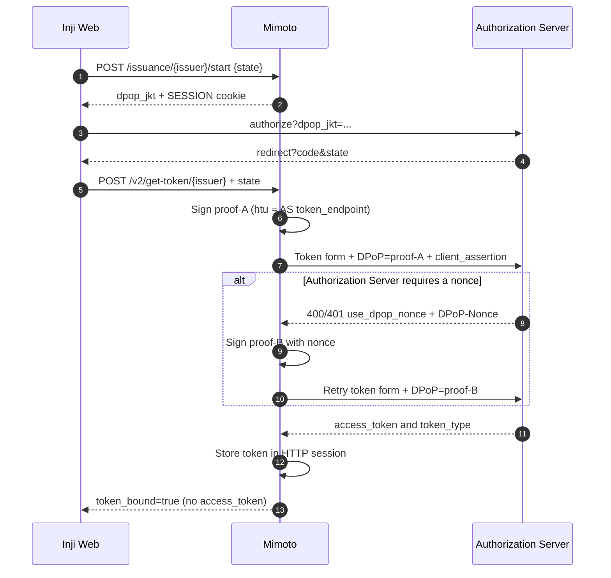
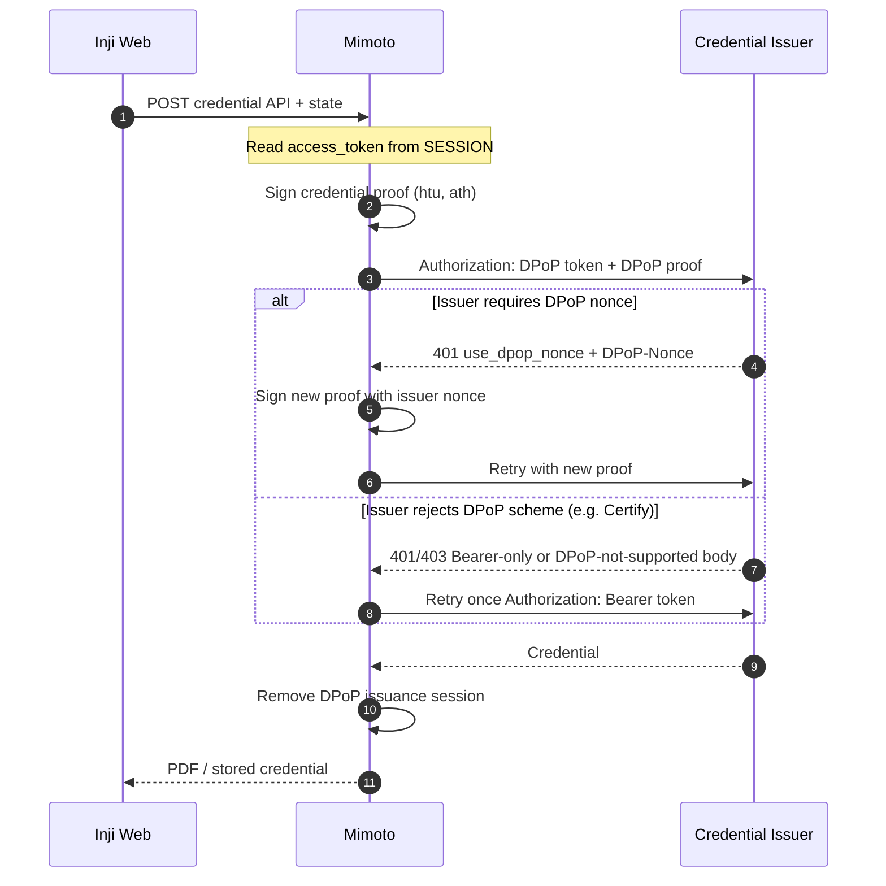
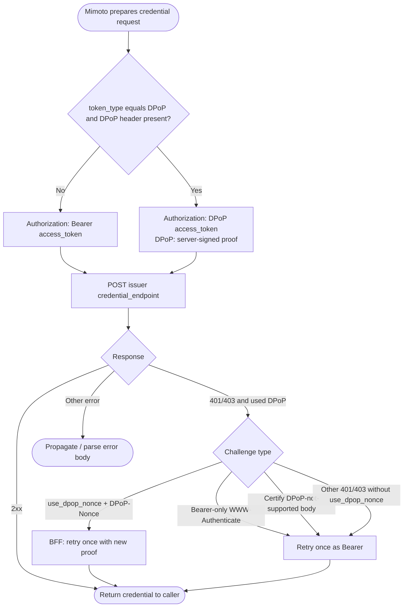
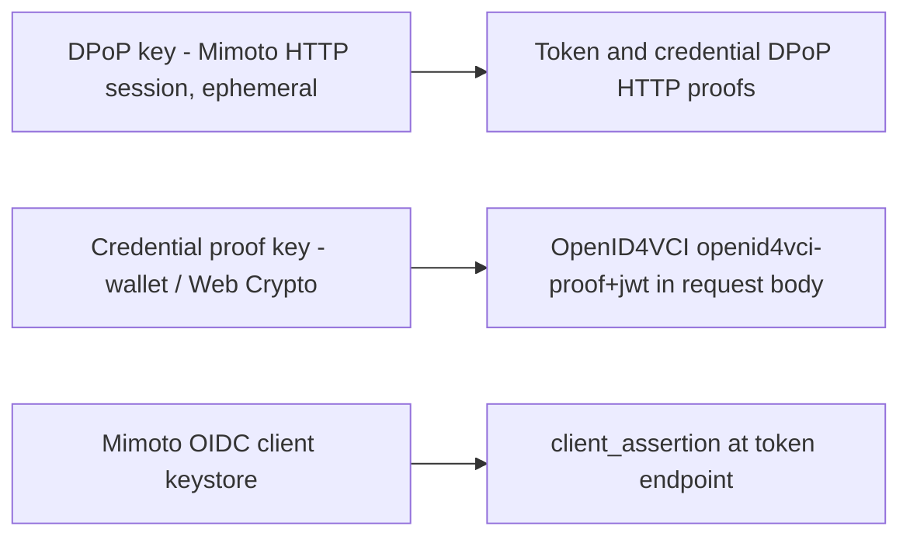

# DPoP Sender-Constrained Access Token Support

This document describes how **Mimoto** supports Demonstrating Proof of Possession (DPoP) for OpenID for Verifiable Credential Issuance (OpenID4VCI) flows used by **Inji Web**.

DPoP binds an OAuth access token to a client-held key. A client presents a request-specific DPoP proof together with the access token, preventing the token from being replayed without the corresponding private key.

Mimoto is the **BFF (Backend for Frontend)** for Inji Web issuance. It generates an ephemeral DPoP key per issuance, signs token and credential proofs, retries `use_dpop_nonce` internally, and keeps the access token and private key in the HTTP session. Inji Web never receives the DPoP private key or the access token.

The implementation follows:

- [RFC 9449 - OAuth 2.0 Demonstrating Proof of Possession](https://www.rfc-editor.org/rfc/rfc9449)
- [OpenID for Verifiable Credential Issuance 1.0](https://openid.net/specs/openid-4-verifiable-credential-issuance-1_0.html)

Related:

- Mobile wallet DPoP (native VCI client owns proofs): [`inji-wallet/docs/dpop-support.md`](https://github.com/inji/inji-wallet/blob/develop/docs/dpop-support.md)
- Earlier spike notes: [`docs/DPoP-Support-Spike-Required-Changes.md`](./DPoP-Support-Spike-Required-Changes.md)

## Supported flows

DPoP is supported for OpenID4VCI **Authorization Code** issuance through Mimoto for:

1. **Guest download** — `POST /credentials/download`
2. **Logged-in wallet store** — `POST /wallets/{walletId}/credentials`

Pre-Authorized Code Flow through Mimoto is out of scope for this delivery.

Token exchange for DPoP uses:

```text
POST /issuance/{issuer}/start
POST /v2/get-token/{issuer}
```

The legacy `POST /get-token/{issuer}` (V1) retains Bearer-only token exchange and does not accept a `DPoP` header.

Clients that still send a `DPoP` header and an `access_token` (SPA/SAP path) continue to work. Inji Web uses the BFF path only.

## Design goals

- Create a DPoP key per issuance in Mimoto and return `dpop_jkt` before the authorize redirect.
- Bind proofs to the **real upstream** Authorization Server token endpoint and Credential Issuer credential endpoint (`htu`), not to Mimoto URLs.
- Exchange the authorization code in Mimoto and attach DPoP to the AS.
- Handle `use_dpop_nonce` inside Mimoto (no browser round-trip).
- Download the credential with a new proof that includes `ath`.
- Keep the access token and DPoP private key server-side; never return them to the SPA.
- Bind that material to the HTTP session cookie (`SESSION`). Logged-in users already have a session; guest callers receive one from `/issuance/{issuer}/start`.
- Keep DPoP keys separate from OpenID4VCI credential proof keys (`openid4vci-proof+jwt`) and from Mimoto `client_assertion` keys.

## Component responsibilities

| Component | Responsibilities |
| --------- | ---------------- |
| Inji Web | Generate PKCE `state` / `code_verifier`; call `POST /issuance/{issuer}/start`; put `dpop_jkt` on the authorize URL; send `state` (not tokens or DPoP proofs) to `/v2/get-token` and download APIs. |
| Mimoto | Generate DPoP key; return `dpop_jkt`; sign token proofs; retry AS `use_dpop_nonce`; store access token in session; return `token_bound: true` without `access_token`; sign credential proofs with `ath`; retry issuer `use_dpop_nonce`; delete the issuance session after download. |
| Authorization Server | Validate token-endpoint proofs, bind DPoP access tokens to the proof key, may issue `DPoP-Nonce` challenges. |
| Credential Issuer | Validate the DPoP-bound access token and credential-endpoint proof, may issue resource-server `DPoP-Nonce` challenges. Some issuers (for example Certify) may reject `Authorization: DPoP` and require Bearer. |

## Key lifecycle and algorithm selection

Mimoto owns the DPoP key lifecycle:

1. `POST /issuance/{issuer}/start` with `{ "state": "<oauth-state>" }` creates an HTTP session (guest) or reuses the logged-in session.
2. Mimoto reads `dpop_signing_alg_values_supported` from Authorization Server metadata.
3. When that list is present, Mimoto uses the **first advertised algorithm it can sign** (`RS256`, `PS256`, or `ES256`). It does not apply a separate client ranking. Example: `["RS256","ES512","EdDSA","ES256K","ES256","ES384"]` → `RS256`.
4. When the metadata value is absent or empty, Mimoto defaults to **ES256**.
5. When the advertised list is non-empty but contains none of `RS256` / `PS256` / `ES256`, algorithm selection fails.
6. Mimoto generates an ephemeral JWK, stores it under session attribute `dpop_issuance` keyed by `state`, and returns RFC 7638 `dpop_jkt`.
7. The same key is used for `dpop_jkt`, the token proof, and the credential proof.
8. After a successful credential download, Mimoto removes the issuance session. The private key never leaves Mimoto.

DPoP algorithm selection is independent of OpenID4VCI credential proof algorithms and of `token_endpoint_auth_signing_alg_values_supported` (client_assertion).

## Client and Mimoto API boundary

### Start — `POST /issuance/{issuer}/start`

```http
POST /issuance/{issuer}/start
Content-Type: application/json

{"state":"<oauth-state>"}
```

Response:

```json
{
  "response": {
    "state": "<oauth-state>",
    "dpop_jkt": "<rfc7638-thumbprint>",
    "dpop_alg": "RS256"
  },
  "errors": []
}
```

Guest callers receive a `SESSION` cookie. Subsequent token and download calls must send credentials (`withCredentials: true`).

### Token — `POST /v2/get-token/{issuer}`

```http
POST /v2/get-token/{issuer}
Content-Type: application/x-www-form-urlencoded

grant_type=authorization_code
&code=...
&redirect_uri=...
&code_verifier=...
&state=<oauth-state>
```

When a BFF issuance session exists for `state`, Mimoto:

1. Builds the confidential-client token request (`client_assertion`, etc.).
2. Signs a DPoP proof with `htu` = the real AS `token_endpoint`.
3. POSTs to `getTokenEndpoint()` (`proxy_token_endpoint` when configured).
4. On `use_dpop_nonce` + `DPoP-Nonce`, signs a new proof with `nonce` and retries once. MOSIP XML `<OAuthError>` bodies are treated as JSON `error` values.
5. Stores `access_token` / `token_type` / `c_nonce` in the session.
6. Returns JSON with `token_bound: true` and **without** `access_token` or `id_token`.

If there is no BFF session, Mimoto still forwards a client `DPoP` header (legacy SPA path).

### Guest credential — `POST /credentials/download`

```http
POST /credentials/download
Content-Type: application/x-www-form-urlencoded

issuer=...
&credential=...
&locale=...
&state=<oauth-state>
```

Mimoto reads the access token from the session, signs a credential proof (`htu` = credential endpoint, `ath` = SHA-256 of the access token), retries issuer `use_dpop_nonce` once, then removes the issuance session.

### Logged-in credential — `POST /wallets/{walletId}/credentials`

```json
{
  "issuer": "...",
  "credentialConfigurationId": "...",
  "state": "<oauth-state>"
}
```

Same server-side token + proof + nonce retry as guest. The logged-in `SESSION` cookie already binds the user.

## DPoP proof contents (Mimoto-built)

Each request receives a newly signed proof with a unique `jti`.

| Claim or header | Token endpoint proof | Credential endpoint proof |
| --------------- | -------------------- | ------------------------- |
| `typ` | `dpop+jwt` | `dpop+jwt` |
| `alg` | Selected asymmetric algorithm | Same algorithm for the flow |
| `jwk` | Public DPoP key | Same public DPoP key |
| `jti` | New value for every proof | New value for every proof and retry |
| `htm` | `POST` | `POST` |
| `htu` | Real AS token endpoint | Real issuer credential endpoint |
| `iat` / `exp` | 60-second window | 60-second window |
| `nonce` | After AS challenge | After issuer challenge |
| `ath` | Not included | Base64url SHA-256 of the access token |

`htu` is normalized without query or fragment. Only the public key appears in the proof header.

## Flow diagrams

### Flow 1 - BFF issuance



### Flow 2 - Token endpoint through Mimoto V2



### Flow 3 - Guest / logged-in credential download



### Flow 4 - Credential endpoint processing inside Mimoto



## Key separation



DPoP keys, OpenID4VCI credential proof keys, and Mimoto `client_assertion` keys are always separate.

## Credential request and `token_type`

| Token response | Mimoto credential request behavior |
| -------------- | ---------------------------------- |
| `token_type: DPoP` and `DPoP` header present | `Authorization: DPoP <access-token>` and attach the DPoP proof. |
| `token_type: Bearer`, another value, missing type, or missing `DPoP` header | `Authorization: Bearer <access-token>` without a DPoP proof. |

## Nonce handling

`c_nonce` and `DPoP-Nonce` serve different purposes:

- `c_nonce` is used by the OpenID4VCI credential proof of possession in the request body.
- `DPoP-Nonce` is used by DPoP proofs in HTTP headers.

### Authorization Server nonce

1. Mimoto sends the first token proof to the AS.
2. On `use_dpop_nonce` with `DPoP-Nonce`, Mimoto rebuilds the proof and retries the AS once.
3. Inji Web does not see this challenge.

### Credential Issuer nonce

1. Mimoto sends a credential-endpoint proof.
2. On issuer `401` with `use_dpop_nonce` and `DPoP-Nonce`, Mimoto rebuilds the proof and retries the issuer once.
3. If there is no BFF session (legacy SPA path), Mimoto still returns the challenge to the client.
4. Authorization Server and Credential Issuer DPoP nonces are not interchangeable.

## Bearer fallback behavior

For an access token used with `token_type: DPoP`, Mimoto applies this credential-endpoint policy:

1. A DPoP `use_dpop_nonce` challenge with a nonce is **not** Bearer-downgraded; the BFF retries with a new proof (legacy SPA clients still receive the challenge).
2. A challenge that advertises only `Bearer` (no DPoP scheme) is retried once using `Authorization: Bearer` without a `DPoP` header (RFC 9449 §7.2).
3. A response body matching Certify’s message `DPoP tokens are not supported. Use a Bearer token.` triggers the same one-time Bearer retry.
4. Other `401` / `403` responses after `Authorization: DPoP` that are **not** `use_dpop_nonce` challenges also trigger one Bearer retry (compatibility for issuers that omit `WWW-Authenticate`).
5. Other failures are propagated without retry.

The Bearer-only retry is intentional compatibility behavior and is logged as a warning.

## Error handling

| Scenario | Behavior |
| -------- | -------- |
| Token V2 AS returns `use_dpop_nonce` (BFF session) | Retry once inside Mimoto; SPA never sees the challenge. |
| Credential issuer returns `use_dpop_nonce` + `DPoP-Nonce` (BFF session) | Retry once inside Mimoto; then remove the issuance session on success. |
| Credential issuer returns Bearer-only `WWW-Authenticate` | Retry once as Bearer. |
| Credential issuer returns Certify DPoP-not-supported body | Retry once as Bearer. |
| Logged-in API called with neither `accessToken`, `state`, nor auth-code grant | `400 invalid_request`. |
| Guest/logged-in called with `state` after `/v2/get-token` | Use the session-bound token; skip internal V1 token exchange. |
| Legacy `/get-token` used for DPoP | Not supported; clients must use `/v2/get-token`. |

## Security characteristics

- The private DPoP key exists only in Mimoto, bound to the HTTP session and OAuth `state`.
- Inji Web never receives the DPoP private key or the access token (`token_bound: true`).
- Proof `htu` values target upstream resource URLs so token binding remains correct across the proxy.
- Credential-endpoint proofs include `ath`, binding the proof to the access token.
- Each proof uses a fresh `jti` and a 60-second validity window.
- DPoP keys remain separate from credential proof keys and from Mimoto client assertion keys.
- Guest issuance relies on the `SESSION` cookie from `/issuance/{issuer}/start`. Cross-origin deployments must send credentials on every issuance call.

## Implementation locations

| Area | Location |
| ---- | -------- |
| Issuance start | `IssuanceController`, `DpopIssuanceSessionService` |
| DPoP key + proof | `DpopProofService` |
| Token V2 controller | `IdpController.getTokenV2` |
| Token V2 service | `IdpServiceImpl.getTokenResponseV2` |
| Guest credential download | `CredentialsController.downloadCredentialAsPDF` |
| Logged-in credential download | `WalletCredentialsController.downloadCredential` |
| Pre-issued token helpers | `DpopResponseHelper` |
| Credential HTTP + Bearer fallback | `RestApiClient.postCredentialApi` |
| WWW-Authenticate parsing | `WwwAuthenticateChallenge` |
| Nonce challenge exception | `DpopChallengeException` |
| Constants | `DpopConstants` |
| Session attribute | `SessionKeys.DPOP_ISSUANCE` |
| VC handlers | `Draft13VCDownloadHandler`, `V1VCDownloadHandler` |
| Advertised token path | `IssuersServiceImpl` → `/v2/get-token/` |
| Auth/CSRF ignore | `application-default.properties` (`/issuance/**`, `/v2/get-token/**`) |

## Client contract summary (Inji Web)

1. Generate PKCE `state` / `code_verifier` in the browser.
2. `POST /issuance/{issuer}/start` with `{ state }` and credentials included; put returned `dpop_jkt` on the authorize URL.
3. `POST /v2/get-token/{issuer}` with the auth-code form **and** `state`. Do not send a `DPoP` header. Treat success as `token_bound` or (legacy) `access_token`.
4. Guest: `POST /credentials/download` with `issuer`, `credential`, and `state`. Do not send `access_token` or `DPoP`.
5. Logged-in: `POST /wallets/{walletId}/credentials` with `issuer`, `credentialConfigurationId`, and `state`. Do not send `accessToken` or `DPoP`.
6. Expect Mimoto to retry AS and issuer `use_dpop_nonce` and to auto-retry Bearer for Certify-like DPoP rejections.

## Out of scope

- DPoP key generation or proof signing in the browser for Inji Web
- DPoP for OpenID4VP presentation flows
- DPoP for wallet-binding / local authentication endpoints
- Refresh-token flows
- Persistent DPoP keys outside the HTTP session
- Pre-Authorized Code Flow through Mimoto
